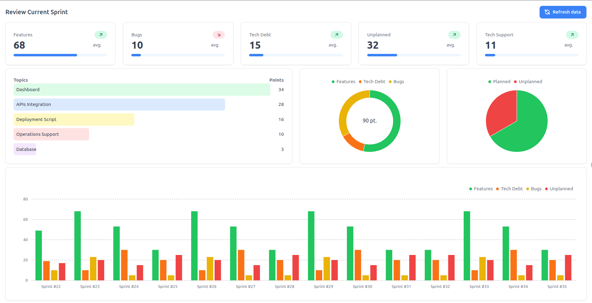

### Notion Dashboard
> A Dashboard to support the visualisation of the work done by a team during a Scrum Sprint. It is based on the Notion APIs to collect all the historical cards info.

### Devs note
In this project i sperimented with the Notion APIs hosting my own server and React app with docker compose.

- The server is a base `Node/Express` server with `quickchart-js` library to allow the feature of returning computed charts as images from one of the urls
- The Dashboard has been built with `React` and `Vite` using the packege `tremor` for a minimalistic and clean UI
